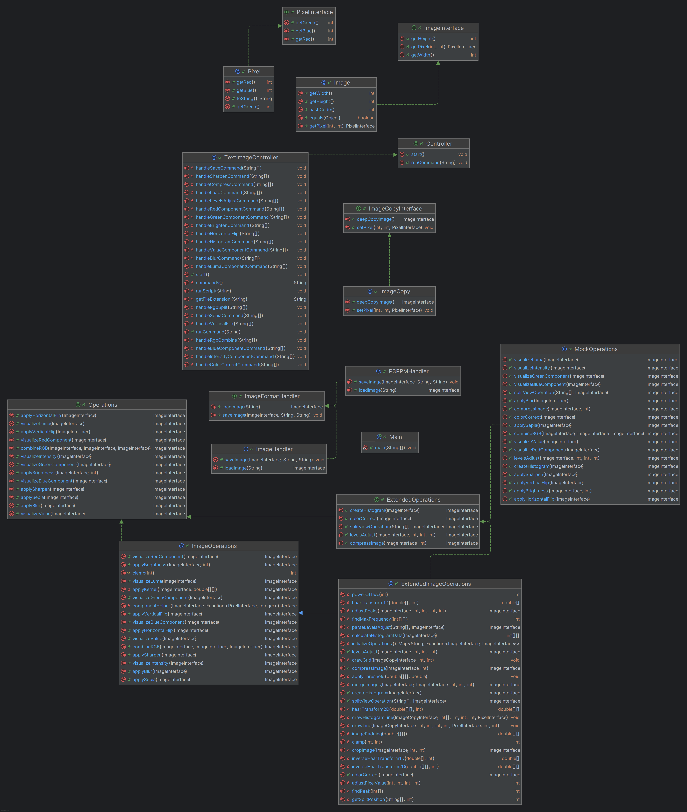

## Image Processor Application

## Overview

This project is a Java-based image processing application that allows users to perform various
operations on images such as vertical-flip, horizontal-flip, brighten, greyscale, sepia and others.
The project uses a Model-View-Controller (MVC) design pattern. The project also supports multiple
file formats like JPG, PNG, JPEG, BMP, PPM (P3 format).

## Project Structure

The project is based on the Model-View-Controller. The code has two interfaces and the Main.java
class.

**1. The Image Controller Interface**

- `TextImageController.java`: The Text Image Controller handles user input and connects the View to
  the model to perform image processing operations.
- `P3PPMHandler.java`: This class is used to load and save images which are of type P3PPM.
- `ImageHandler.java`: This class is an implementation of the ImageFormatHandler Interface where it
  will load and save images based on the file type which is sent as an input.-
- `ImageFormatHandler.java`: This is an interface which acts as a universal template for saving and
  loading images.
- `Controller.java`: This is an interface which is used to run any command or to get an image from
  the Map.

**2. The Image Model Interface**

- `Image.java`: This class defines the main image class and creates an object Image.
- `ImageOperations.java`: The ImageOperations class contains all the operations that will be
  performed on the images.
- `Operations.java`:  The Operations interface contains the function prototype of all the operations
  that can be performed on the image such as horizontal/vertical flipping, brighten/darken,
  component extraction and so on.
- `Pixel.java`: Represents a data structure of type pixel in the image with RGB values.
- `ImageInterface.java`: This interface is used for accessing an Image values like the
  Pixel, Height and the Width.
- `PixelInterface.java`: The pixel interface is used for getting the Pixel values (R, G, B).
- `ExtendedImageOperations.java`: This class contains functions which are implemented in later
  stage of the project.
- `ExtendedOperations.java`: This interface extends the older interface so all functionality is
  used. This interface contains the prototype of all the new operations that can be performed
  on the Image such as compress, histogram, levels-adjust and so on.
- `ImageCopy.java`: This class is used to create a copy of this Image. This will ensure that the
  original Image is immutable.
- `ImageCopyInterface.java`: This interface is used to get the pixels or set the pixels in the
  Image.
- `MockOperations.java`:
-

**3. Main File**

`Main.java`: The Main class is used to run the project after which the user can input the commands
or run the script file.

**Functions that can be run in the Main File**

- Load an Image - load <image-path> <image-name>
- Save an Image - save <image-path> <image-name>
- Extract Red Component of the Image - red-component <image-name> <dest-image-name>
- Extract Green Component of the Image - green-component <image-name> <dest-image-name>
- Extract Blue Component of the Image - blue-component <image-name> <dest-image-name>
- Extract Blue Component of the Image - value-component <image-name> <dest-image-name>
- Extract Luma Component of the Image - luma-component <image-name> <dest-image-name>
- Extract Intensity Component of the Image - intensity-component <image-name> <dest-image-name>
- Flip the Image Horizontally - horizontal-flip <image-name> <dest-image-name>
- Flip the Image Vertically - vertical-flip <image-name> <dest-image-name>
- Brighten the Image by a given number - brighten <increment> <image-name> <dest-image-name>
- Split the Image's RGB Components - rgb-split <image-name> <dest-image-name-red> <
  dest-image-name-green>
- Combine the RGB Components to give the original Image - rgb-combine <dest-image-name> <
  red-image> <green-image> <blue-image>
- Blur the Image - blur <image-name> <dest-image-name>
- Sharpen the Image - sharpen <image-name> <dest-image-name>
- Apply a Sepia Filter - sepia <image-name> <dest-image-name>
- Compress a Image - compress <percentage> <image-name> <dest-file-path>
- Create Histogram - histogram <image-name> <dest-file-path>
- Perform Colour Correction - color-correct <image-name> <dest-image-name>
- Perform Levels Adjust - levels-adjust <b> <m> <w> <image-name> <dest-image-name>
- Split and perform function - <Normal function command> <split> <percentage-split>
- Run a Script File - run <script-file-path>

**4. Class Diagram**

**5. Images**

This folder contains sample images for testing purposes. Images are available in various formats
like BMP, JPEG, JPG, PPM(P3) and PNG:

- BMP: `Sample.bmp`
- JPEG: `Sample.jpeg`
- JPG: `Sample.jpg`
- PNG: `Sample.png`
- PPM: `Sample.ppm`

**6. How to Run**

- Refer USEME.md for a list of commands and their usage.
- Following are 2 sample scripts which can be run to get a better understanding of this application:
  "src/res/Scripts/PPM/commands1.txt" "src/res/Scripts/PNG/commands1.txt"

**THE IMAGES USED IN THE PROJECT ARE OWNED BY ABHISHEK RAGHURAMAN AND AYUSH VINEET JAIN AND WE
AUTHORIZE TO USE THE IMAGES**