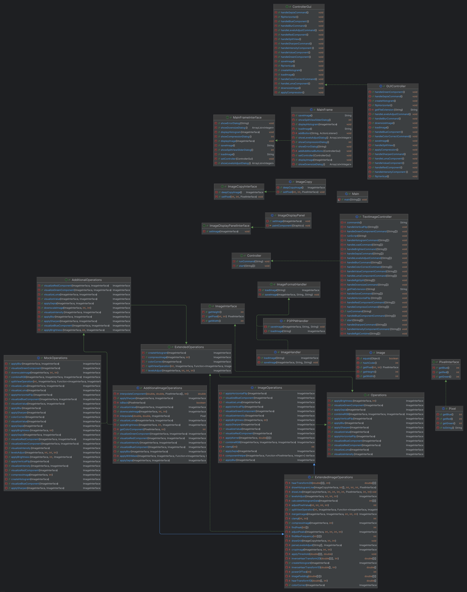

## Image Processor Application

## Overview

This project is a Java-based image processing application that allows users to perform various
operations on images such as vertical-flip, horizontal-flip, brighten, greyscale, sepia and others.
The project uses a Model-View-Controller (MVC) design pattern. The project also supports multiple
file formats like JPG, PNG, JPEG, BMP, PPM (P3 format).

# Updates

1. **View**

- A fully functional GUI has been implemented to enhance usability.
- Features accessible through the GUI include:
    - Load
    - Save
    - Blur
    - Sharpen
    - Sepia filter
    - Red, Green, and Blue component extraction
    - Luma, Value and Intensity Component extraction
    - Horizontal and Vertical flipping
    - Histogram display
    - Image compression
    - Levels adjustment
    - Downscaling of an Image
- Added a split-view slider for side-by-side comparison of the original and modified images.

2. **Model Changes:**

- **Downsizing Functionality:** The model now supports downsizing images to custom dimensions,
  maintaining aspect ratio if required. To add this functionality we have created a new class
  called AdditionalImageOperations which implements the AdditionalOperations Interface which extends
  the ExtendedOperations interface.
- **Masking of Images:** Introduced masking functionality for selective modifications to specific
  image regions. The Masking of Images functionality is also added in the AdditionalImageOperations
  class which implements the AdditionalOperations Interface which extends the ExtendedOperations
  Interface.
- **Split View Operations:** The Split View operation of our earlier implementation took input of
  Array of String, which is not supported by the GUI Implementation. The Split View is changed to
  take the input components directly instead of parsing them from the String.
- **Levels Adjust:** The levels Adjust Operation has been modified to implement the correct logic
  by using Quadratic Co-efficients (As suggested in Manual Grading in previous Assignment)

3. **Controller Changes**

- **ControllerGUI:** This is a controller Interface for the GUI that implements functions which are
  required for the GUI. This ensures that the older controller Interface remains unchanged.
- **GUIController:** This is the controller class which Interacts with the View for the Graphical
  User
  Interface.
- **TextImageController:** The TextImageController has changes for the functions in the way the
  SplitOperation is being performed. This was essential as our earlier implementation of Split in
  the model supported an Array of String as input and that would not be possible with the GUI
  implementation. It
  also includes the functionality of Downsizing an Image and Masking of an Image.

## Project Structure

The project is based on the Model-View-Controller. The code has two interfaces and the Main.java
class.

**1. The Image Controller Package**

- `TextImageController.java`: The Text Image Controller handles user input and connects the View to
  the model to perform image processing operations.
- `P3PPMHandler.java`: This class is used to load and save images which are of type P3PPM.
- `ImageHandler.java`: This class is an implementation of the ImageFormatHandler Interface where it
  will load and save images based on the file type which is sent as an input.-
- `ImageFormatHandler.java`: This is an interface which acts as a universal template for saving and
  loading images.
- `Controller.java`: This is an interface which is used to run any command or to get an image from
  the Map.

**2. The Image Model Package**

- `Image.java`: This class defines the main image class and creates an object Image.
- `ImageOperations.java`: The ImageOperations class contains all the operations that will be
  performed on the images.
- `Operations.java`:  The Operations interface contains the function prototype of all the operations
  that can be performed on the image such as horizontal/vertical flipping, brighten/darken,
  component extraction and so on.
- `Pixel.java`: Represents a data structure of type pixel in the image with RGB values.
- `ImageInterface.java`: This interface is used for accessing an Image values like the
  Pixel, Height and the Width.
- `PixelInterface.java`: The pixel interface is used for getting the Pixel values (R, G, B).
- `ExtendedImageOperations.java`: This class contains functions which are implemented in later
  stage of the project.
- `ExtendedOperations.java`: This interface extends the older interface so all functionality is
  used. This interface contains the prototype of all the new operations that can be performed
  on the Image such as compress, histogram, levels-adjust and so on.
- `ImageCopy.java`: This class is used to create a copy of this Image. This will ensure that the
  original Image is immutable.
- `ImageCopyInterface.java`: This interface is used to get the pixels or set the pixels in the
  Image.
- `MockOperations.java`: This class is created to Mock the Model class implementation of Additional
  Operations
- `AdditionalImageOperations.java`: This class contains features which are implemented in the third
  stage of the project. These features include Downscaling of an image and Masking of an image.
- `AdditionalOperations.java`: This interface extends the ExtendedOperations.java interface so all
  the older functionality is used. This interface contains the prototype of all the new operations
  that can be performed on the Image.

**3. The Image View Package**

- `ImageDisplayPanel.java`: This Class is used to display the given Image on the Graphical User
  Interface
- `ImageDisplayPanelInterface.java`: The ImageDisplayPanelInterface is the interface for the
  ImageDisplayPanel. This contains all the public functions of the class.
- `MainFrame.java`: The MainFrame is the Main Class of our View Package. The entire GUI is created
  in the
  MainFrame Class. The MainFrame class is communicating with the controller.
- `MainFrameInterface.java`: This interface contains all the functions for the MainFrame to be used.
- `MainFrameMock.java`: This class is created to Mock the View Package implementation of MainFrame

**3. Main File**

`Main.java`: The Main class is used to run the project after which the user can input the commands
or run the script file.

**Functions that can be run in the Main File**

- **Loads an image**: load <image-path> <image-name>
- **Saves an Image**: save <image-path> <image-name>
- **Gets Red Component of Image**: red-component <image-name> <dest-image-name>
- **Gets the Red Component of the first p% of the Image while retaining the rest**: red-component <
  image-name> <dest-image-name> split p
- **Applies the red greyscale on the pixels of the image with respect to the mask image**
  red-component <image-name> <mask-image-name> <dest-image-name>
- **Gets the Green Component of the Image**: green-component <image-name> <dest-image-name>
- **Gets the Green Component of the first p% of the Image while retaining the rest**:
  green-component <image-name> <dest-image-name> split p
- **Applies the green greyscale on the pixels of the image with respect to the mask image**:
  green-component <image-name> <mask-image-name> <dest-image-name>
- **Gets the Blue Component of the Image**: blue-component <image-name> <dest-image-name>
- **Gets the Blue Component of the first p% of the Image while retaining the rest**:
  blue-component <image-name> <dest-image-name> split p
- **Applies the blue greyscale on the pixels of the image with respect to the mask image**:
  blue-component <image-name> <mask-image-name> <dest-image-name>
- **Gets the Value Component of the Image**: value-component <image-name> <dest-image-name>
- **Gets the Value Component of the first p% of the Image while retaining the rest**:
  value-component <image-name> <dest-image-name> split p
- **Applies the value visualization on the pixels of the image with respect to the mask image**:
  value-component <image-name> <mask-image-name> <dest-image-name>
- **Gets the Luma Component of the Image**: luma-component <image-name> <dest-image-name>
- **Gets the Luma Component of the first p% of the Image while retaining the rest**:
  luma-component <image-name> <dest-image-name> split p
- **Applies the luma visualization on the pixels of the image with respect to the mask image**:
  luma-component <image-name> <mask-image-name> <dest-image-name>
- **Gets the Intensity Component of the Image**: intensity-component <image-name> <dest-image-name>
- **Gets the Intensity Component of the first p% of the Image while retaining the rest**:
  intensity-component <image-name> <dest-image-name> split p
- **Applies the intensity visualization on the pixels of the image with respect to the mask image**:
  intensity-component <image-name> <mask-image-name> <dest-image-name>
- **Flips image horizontally**: horizontal-flip <image-name> <dest-image-name>
- **Flips image vertically**: vertical-flip <image-name> <dest-image-name>
- **Brightens the Image**: brighten <increment> <image-name> <dest-image-name>
- **Brightens the image depending on the mask image**: brighten <increment> <image-name> <
  dest-image-name> mask <mask-image-name>
- **Splits RGB channels**: rgb-split <image-name> <dest-image-name-red> <dest-image-name-green> <
  dest-image-name-blue>
- **Combines RGB channels**: rgb-combine <dest-image-name> <red-image> <green-image> <blue-image>
- **Blurs the image**: blur <image-name> <dest-image-name>
- **Blurs the first p% of the Image while retaining the rest**: blur <image-name> <dest-image-name>
  split p
- **Blurs the image according to the mask image**:  blur <image-name> <mask-image-name> <
  dest-image-name>
- **Sharpens the image**: sharpen <image-name> <dest-image-name>
- **Sharpens the first p% of the Image while retaining the rest**: sharpen <image-name> <
  dest-image-name> split p
- **Sharpens the image according to the mask image** sharpen <image-name> <mask-image-name> <
  dest-image-name>
- **Produces a sepia tone of the image>**: sepia <image-name> <dest-image-name>
- **Produces a sepia tone of the first p% of the Image while retaining the rest**: sepia <
  image-name> <dest-image-name> split p
- **Applies the sepia visualization on the pixels of the image with respect to the mask image**:
  sepia <image-name> <mask-image-name> <dest-image-name>
- **Compresses the image by the given percentage**: compress percentage <image-name> <
  dest-image-name>
- **Generates a histogram of the given Image**: histogram <image-name> <dest-image-name>
- **Generates a color corrected version of the given Image**: color-correct <image-name> <
  dest-image-name>
- **Generates a color corrected version of the first p% of the given Image** color-correct <
  image-name> <dest-image-name> split p
- **Generates a level adjusted version of the given Image as per the given black, mid and white
  points**: levels-adjust b m w <image-name> <dest-image-name>
- **Generates a level adjusted version of the first p% of the given Image as per the given black,
  mid and white points**: levels-adjust b m w <image-name> <dest-image-name> split p
- **Downscales an image to fit target height and width**: downsize <image-name> <dest-image-name> <
  target-image-width> <target-image-height>
- **Run commands from a script file**: run <script-file-path>

**4. Class Diagram**

**5. Images**

This folder contains sample images for testing purposes. Images are available in various formats
like BMP, JPEG, JPG, PPM(P3) and PNG:

- BMP: `Sample.bmp`
- JPEG: `Sample.jpeg`
- JPG: `Sample.jpg`
- PNG: `Sample.png`
- PPM: `Sample.ppm`

**6. How to Run**

- Refer USEME.md for a list of commands and their usage.
- Following are 2 sample scripts which can be run to get a better understanding of this application:
  "res/Scripts/PPM/commands1.txt" "res/Scripts/PNG/commands1.txt"

**THE IMAGES USED IN THE PROJECT ARE OWNED BY ABHISHEK RAGHURAMAN AND AYUSH VINEET JAIN AND WE
AUTHORIZE TO USE THE IMAGES**