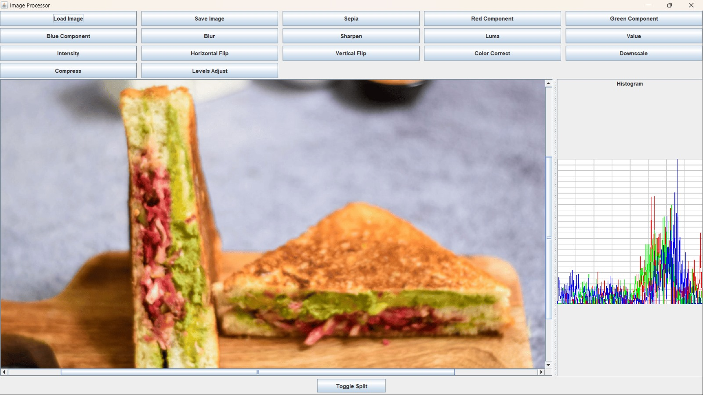

# USE ME File for Image Processing Application

The Image Processing application supports different image processing functions that can be
performed. The commands allow to manipulate images and save them under specified names.
Below is a summary of each command and conditions for their use.

How to use the GUI?
Please find the jar file in the res folder. Run the jar with the below command in the terminal:
`java -jar Program.jar`

Following is how the Graphical User Interface looks:

---

## Supported Commands

### 1. blur

- Description: This function will apply a blur effect to an image.
- Usage: blur <image-name> <dest-image-name>
- Usage with split: blur <image-name> <dest-image-name> split <split-percentage>
- Usage with mask: blur <image-name> <dest-image-name> <masked-image-name>
- Example:
    - blur test output
    - blur myImage blurredImage split 50
- Conditions:
    - If the user is using the split option, the user should provide a valid percentage (1–100).
    - Dependencies: The <image-name> must have already been loaded in the application.

### 2. sharpen

- Description: sharpens an image.
- Usage: sharpen <image-name> <dest-image-name>
- Usage with split: sharpen <image-name> <dest-image-name> split <split-percentage>
- Usage with mask: sharpen <image-name> <dest-image-name> <masked-image-name>
- Example:
    - sharpen test output
    - sharpen myImage blurredImage split 50
- Conditions:
    - If the user is using the split option, the user should provide a valid percentage (1–100).
    - Dependencies: The <image-name> must have already been loaded in the application.

### 3. red-component

- Description: Extracts the red component of the image.
- Usage: red-component <image-name> <dest-image-name>
- Usage with split: red-component <image-name> <dest-image-name> <split-percentage>
- Usage with mask: red-component <image-name> <dest-image-name> <masked-image-name>
- Example:
    - red-component myImage redImage
    - red-component myImage redImage split 50
- Conditions:
    - Note: The image must be loaded prior to running this command.
    - If the user is using the split option, the user should provide a valid percentage (1–100).
    - Applies only to color images: This command won’t work on grayscale images.

### 4. green-component

- Description: Extracts the green component of the image.
- Usage: green-component <image-name> <dest-image-name>
- Usage with split: green-component <image-name> <dest-image-name> split <split-percentage>
- Usage with mask: green-component <image-name> <dest-image-name> <masked-image-name>
- Example:
    - green-component test output
    - green-component test output split 50
- Conditions:
    - Note: Image must be loaded before running this command.
    - If the user is using the split option, the user should provide a valid percentage (1–100).
    - Applies only to color images: This command won’t work on grayscale images.

### 5. blue-component

- Description: Extracts the blue component of the image.
- Usage: blue-component <image-name> <dest-image-name>
- Usage with split: blue-component <image-name> <dest-image-name> split <split-percentage>
- Usage with mask: blue-component <image-name> <dest-image-name> <masked-image-name>
- Example:
    - blue-component test output
    - blue-component test output split 50
- Conditions:
    - Note: Image must be loaded before running this command.
    - If the user is using the split option, the user should provide a valid percentage (1–100).
    - Applies only to color images: This command won’t work on grayscale images.

### 6. intensity-component

- Description: Calculates the intensity of the image by averaging the RGB components.
- Usage: intensity-component <image-name> <dest-image-name>
- Usage with split: intensity-component <image-name> <dest-image-name> split <split-percentage>
- Usage with mask: intensity-component <image-name> <dest-image-name> <masked-image-name>
- Example:
- intensity-component test output
- intensity-component test output split 50
- Conditions:
    - Note: Image must be loaded before running this command.
    - If the user is using the split option, the user should provide a valid percentage (1–100).
    - Applies only to color images.

### 7. luma-component

- Description: This function extracts the luma (brightness) component of the image
  using a weighted sum of RGB values.
- Usage: luma-component <image-name> <dest-image-name>
- Usage with split: luma-component <image-name> <dest-image-name> split <split-percentage>
- Usage with mask: luma-component <image-name> <dest-image-name> <masked-image-name>
- Example:
- luma-component test output
- luma-component test output split 50
- Conditions:
    - Note: Image must be loaded before running this command.
    - If the user is using the split option, the user should provide a valid percentage (1–100).
    - Applies only to color images.

### 8. value-component

- Description: Extracts the value component (the maximum of RGB values for each pixel).
- Usage: value-component <image-name> <dest-image-name>
- Usage with split: value-component <image-name> <dest-image-name> split <split-percentage>
- Usage with mask: value-component <image-name> <dest-image-name> <masked-image-name>
- Example:
- value-component test output
- value-component test output split 50
- Conditions:
    - Note: Image must be loaded before running this command.
    - If the user is using the split option, the user should provide a valid percentage (1–100).
    - Applies only to color images.

### 9. load

- Description: Loads an image from the specified file path into the application for processing.
- Usage: load <file-path> <image-name>
- Example: load src/images/sample.png myImage
- Conditions:
- Note: Ensure the file path is correct and accessible.
- The image name specified will be used to reference this image in subsequent commands.

### 10. save

- Description: Saves the specified image to a given file path.
- Usage: save <image-name> <file-path>
- Example: save myImage src/images/processed_image.png
- Conditions:
    - Note: The image must be loaded or created through a command before saving.
    - Ensure that the destination directory exists, or provide a valid file path where the
      image can be saved.

### 11.brighten

- Description: Increases or decreases the brightness of the image.
- Usage: brighten <value> <image-name> <dest-image-name>
- Example:
- brighten 20 test output
- brighten -10 test output split 50
- Conditions:
    - Note: Image must be loaded before running this command.
    - The brightness value can be positive (to brighten) or negative (to darken).
    - If using the split option, provide a percentage between 1 and 100.

### 12. sepia

- Description: Applies a sepia tone effect to the specified image.
- Usage: sepia <image-name> <dest-image-name>
- Usage with split: sepia <image-name> <dest-image-name> split <split-percentage>
- Usage with mask: sepia <image-name> <dest-image-name> <masked-image-name>
- Example: sepia test output
- Conditions:
    - Note: Image must be loaded before running this command.
    - Applies only to color images: This command won’t work on grayscale images.

### 13. horizontal-flip

- Description: Flips the image horizontally.
- Usage: horizontal-flip <image-name> <dest-image-name>
- Example: horizontal-flip test output
- Conditions:
    - Note: The image must be loaded before running this command.

### 14. vertical-flip

- Description: Flips the image vertically.
- Usage: vertical-flip <image-name> <dest-image-name>
- Example: vertical-flip test output
- Conditions:
    - Note: The image must be loaded before running this command.

### 15. compress

- Description: Compresses the image file to reduce file size without significant quality loss.
- Usage: compress <image-name> <dest-image-name> <compression-level>
- Example: compress test output 70
- Conditions:
    - Note: Image must be loaded before running this command.
    - compression-level should be a percentage (e.g., 70 for 70% quality).
    - Higher percentages retain more quality but result in larger file sizes.

### 16. histogram

- Description: Generates a histogram for each color channel (red, green, and blue) in the image.
- Usage: histogram <image-name> <dest-image-name>
- Example: histogram test output
- Conditions:
    - Note: Image must be loaded before running this command.
    - This command is generally used for analysis and does not alter the original image.

### 17. color-correct

- Description: Adjusts the color balance of the image to correct color imbalances.
- Usage: color-correct <image-name> <dest-image-name>
- Usage with split: color-correct <image-name> <dest-image-name> split <split-percentage>
- Example:
    - color-correct test output
    - color-correct test output split 50
- Conditions:
    - Note: Image must be loaded before running this command.

### 18. levels-adjust

- Description: Adjusts the brightness levels across shadows, midtones, and highlights in the image.
- Usage: levels-adjust <image-name> <dest-image-name> <black-level> <mid-level> <white-level>
- Usage with split: levels-adjust <black-level> <mid-level> <white-level> <image-name> <
  dest-image-name> split <split-percentage>
- Example:
    - levels-adjust test output 20 50 90
    - levels-adjust test output 20 50 90 split 30
- Conditions:
    - Note: Image must be loaded before running this command.
    - Levels range from 0 to 100, where 0 is the darkest and 100 the brightest.

### 19. downsize

- Description: This will downsize the Image to the given width and height.
- Usage: downsize <image-name> <dest-image-name> <width> <height>
- Example:
    - downsize test output 100 100
- Conditions:
    - Note: Image must be loaded before running this command.
    - The width and height of the new Image should be less than the widht and height of the current
      Image

### 19. run-script

- Description: Runs a batch of commands from a file.
- Usage: run-script <script-file-path>
- Example: run-script commands.txt
- Conditions:
    - The script file should contain one command per line.
    - Commands in the script file should follow the same format as above.
    - Note: Ensure all required images are loaded within the script file before processing commands.

---

## Example Usage in Order

1. Load the image(s) (e.g., load myImage path/to/image.png).
2. Apply commands as desired:
    - brighten test output
    - blur test output
    - value-component test output
3. Optionally, run a script file with multiple commands:
    - run-script path/to/script.txt

---

